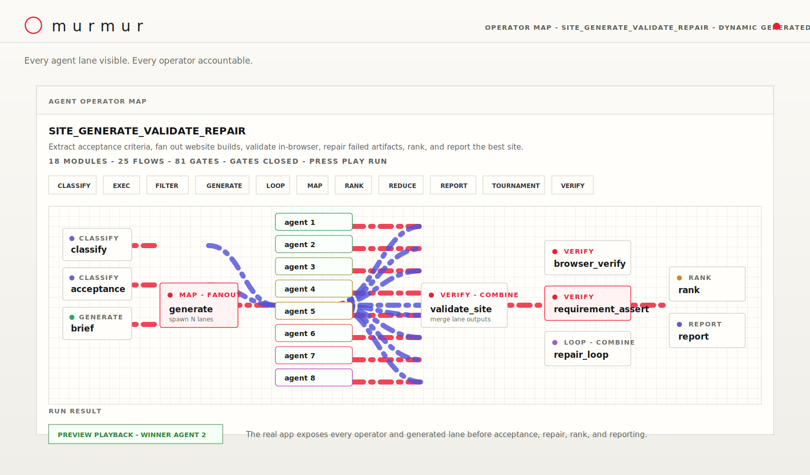
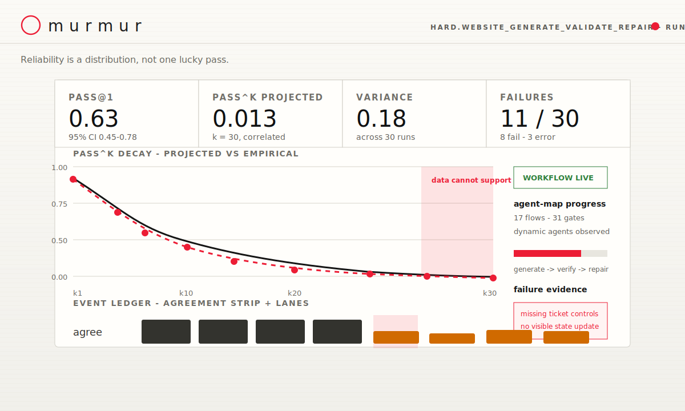
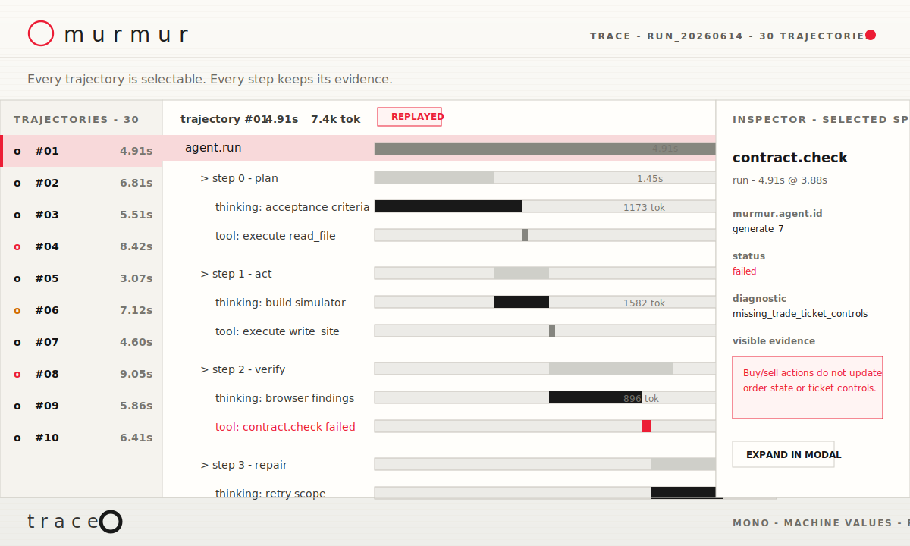

<h1 align="center">Murmur</h1>

<p align="center"><strong>Open-source reliability harness for cheap coding agents.</strong></p>

<p align="center">
  <a href="https://github.com/Zwc-11/Murmur-ai-harness/actions/workflows/ci.yml"></a>
  <a href="LICENSE"></a>
  
  
  
</p>

Murmur makes coding-agent output measurable. It runs a task through multiple
isolated agent attempts, checks every result against an explicit contract, and
produces proof artifacts that show what passed, what failed, where it failed, and
how reliable the workflow actually is.

Instead of trusting one lucky run, Murmur shows the distribution: `pass@1`,
projected and empirical `pass^k`, variance, failures, cost, latency, event logs,
trace spans, and acceptance evidence.

## Why It Exists

Cheap coding agents are useful, but a single generated patch is not enough for
production work. You need to know:

- Did the output satisfy the task contract?
- Did the same workflow succeed across multiple isolated attempts?
- Which step caused the failure?
- Was the failure a bad model answer, a tool issue, a missing artifact, or a weak
  validator?
- Can CI block only statistically real regressions instead of noisy dips?

Murmur is the harness for answering those questions.

## What Murmur Does

- **Runs agent fan-out**: executes `N` independent attempts for the same task.
- **Checks contracts first**: verifies task-specific requirements before trusting
  any artifact.
- **Shows reliability metrics**: reports `pass@1`, `pass^k`, confidence
  intervals, variance, failures, cost, and latency.
- **Explains failures**: stamps failed spans with stable failure classes,
  diagnostic IDs, and evidence.
- **Records traces**: writes `gen_ai.*`-style spans and Murmur-specific
  attributes for every workflow step.
- **Gates CI**: blocks pull requests only when the reliability regression is
  statistically meaningful.
- **Works offline**: deterministic scaffolds let you demo and test the harness
  without API keys.

## Screenshots

The screenshots below come from a hard website-generation task. Murmur correctly
rejected the artifact because the generated simulator missed required trade
ticket controls and did not update visible state after buy/sell actions.

| Agent workflow map | Reliability report | Trace viewer |
| --- | --- | --- |
| [](docs/images/workflow-map.svg) | [](docs/images/fan-report.svg) | [](docs/images/trace-viewer.svg) |
| Live operator DAG with dynamic agent fan-out | Distribution-level reliability and failure summary | Per-agent span waterfall with selected trajectory evidence |

## Quickstart

```bash
git clone https://github.com/Zwc-11/Murmur-ai-harness.git
cd Murmur-ai-harness
python -m venv .venv
. .venv/bin/activate        # Windows: .venv\Scripts\activate
python -m pip install -e ".[dev]"
pytest
```

Run the local workbench:

```bash
murmur serve
```

Open the printed URL, enter a coding or artifact-generation goal, choose whether
to use a real model, and run the agents. Without an API key, leave **Use model**
unchecked to run deterministic offline demos.

## Common Commands

Run a contract-first fix/test workflow:

```bash
murmur fix-test --cmd "python -m pytest tests/test_checkout.py -q" --budget 0.50
```

Run a synthetic reliability fan-out:

```bash
murmur run --n 30 --success-rate 0.7 --error-rate 0.1 --seed 7
```

Render a local trace viewer:

```bash
murmur trace --n 30 --seed 7 --replay
```

Gate a branch against a reliability baseline:

```bash
murmur gate --branch main --n 20 --update-baseline
murmur gate --branch main --n 20 --scaffold worse --success-delta -0.12
```

## Output Artifacts

Murmur writes proof files under `.murmur/`:

- `events.jsonl`: append-only event log
- `proof.json`: machine-readable proof
- `proof.md` or `report.html`: reviewer-facing proof
- `fan.html`: reliability report
- `trace.html`: span waterfall and inspector
- `contract.yaml` / acceptance contract files
- generated artifacts such as `site/index.html`, patches, or program outputs

## Architecture

Murmur is Python-first and uses a ports-and-adapters architecture. The core owns
contracts, events, replay, metrics, and orchestration. Models, tools, judges,
storage, tracing, reports, and external agent frameworks plug in through
adapters.

The repo includes:

- contract-first execution
- policy-controlled tools
- workflow planning and fan-out
- trace importers for common agent event formats
- reliability report rendering
- failure diagnosis
- statistical CI gate
- offline deterministic demos
- SWE-bench wiring behind a real-model/Docker requirement

See [docs/architecture.md](docs/architecture.md) for the full design and roadmap.

## Status

Implemented and locally validated:

- local workbench
- deterministic offline demos
- reliability fan-out reports
- trace viewer
- contract-first fix/test flow
- statistical regression gate
- GitHub Action wrapper
- public trace importers
- SWE-bench adapter wiring with fake-model tests

Not claimed yet:

- a public paid SWE-bench headline number from a frontier model and Docker
  evaluator. Murmur intentionally refuses to print benchmark-like numbers unless
  the real model and evaluator actually ran.

## Documentation

- [Quickstart](docs/quickstart.md)
- [Architecture](docs/architecture.md)
- [GitHub Action](docs/github-action.md)
- [Flock workflow engine](docs/flock.md)
- [LangSmith MCP loop](docs/LANGSMITH_MCP_LOOP.md)

## Author

Built and maintained by **Caesar Zhou Wei Chen** ([@Zwc-11](https://github.com/Zwc-11)).

Released under the [MIT License](LICENSE).
