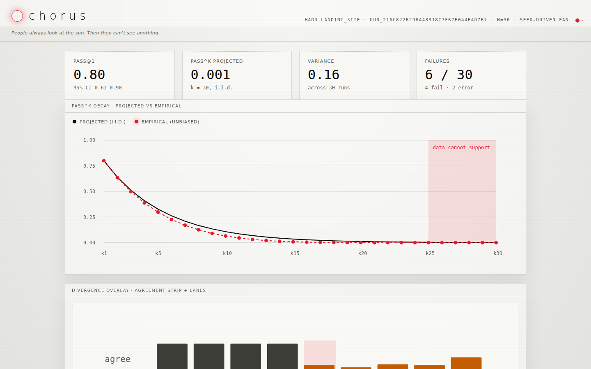
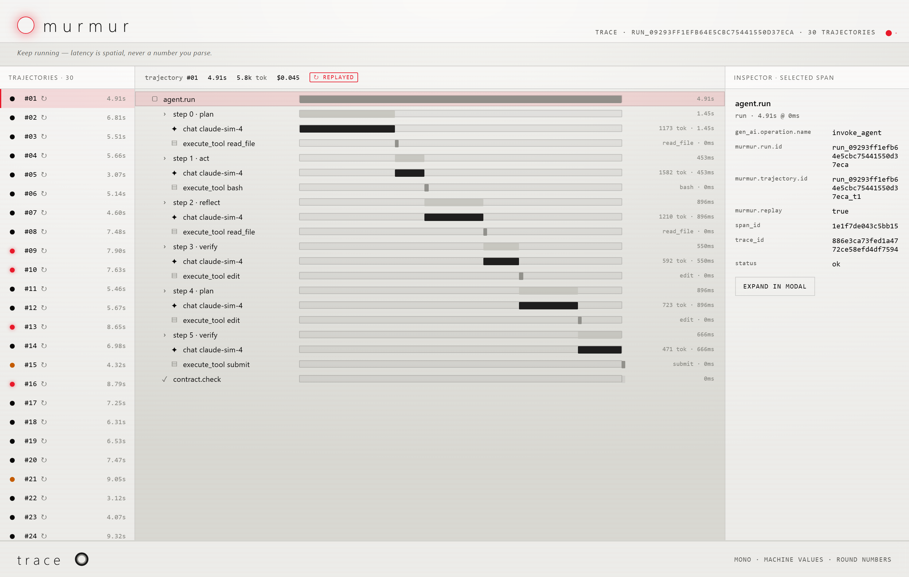
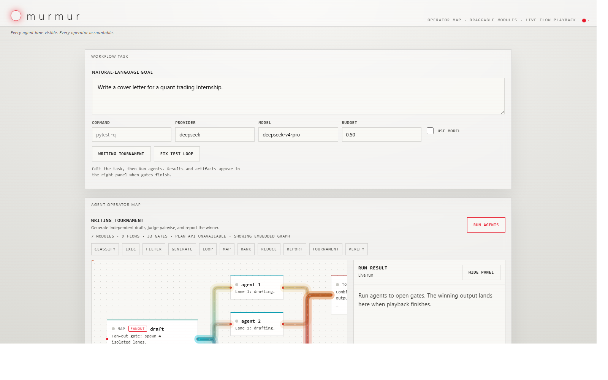
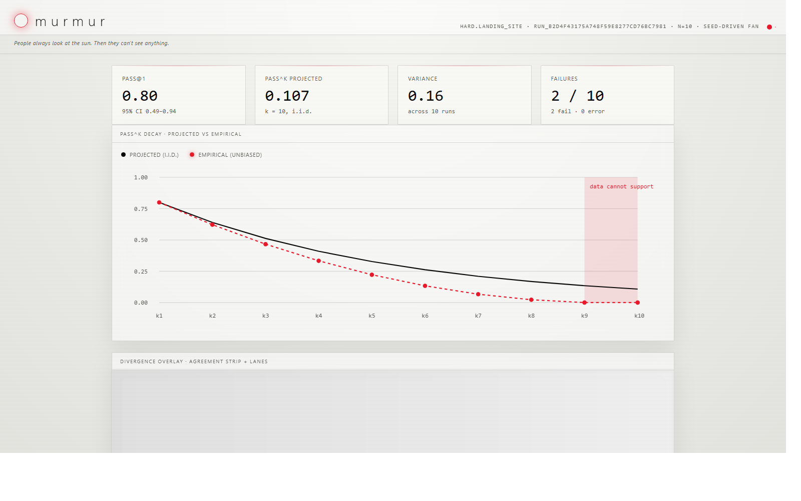

<h1 align="center">Murmur</h1>

<p align="center"><strong>Open-source reliability harness for cheap coding agents.</strong></p>

<p align="center">
  <a href="https://github.com/Zwc-11/Murmur-ai-harness/actions/workflows/ci.yml"></a>
  <a href="LICENSE"></a>
  
  
  
</p>

Murmur makes coding-agent output measurable. It runs a task through multiple
isolated agent attempts, checks every result against an explicit contract, and
produces proof artifacts that show what passed, what failed, where it failed,
and how reliable the workflow actually is. Instead of trusting one lucky run,
Murmur shows the distribution: `pass@1`, projected and empirical `pass^k`,
Wilson confidence intervals, failure classes, cost, latency, event logs, and
trace spans.

`pass^k` — the probability that *all* `k` repeated trials succeed — was
introduced by Sierra's τ-bench ([arXiv:2406.12045](https://arxiv.org/abs/2406.12045))
to measure agent reliability across repeated trials. Murmur's contribution is
operational: contract-first validation of every attempt, stable failure-class
stamping on every failed trajectory, and statistical CI enforcement of `pass^k`
on coding workflows — including [gating this repo's own pull requests](#the-ci-gate-dogfooded-on-this-repo).

Murmur is a harness, not a model. It ships a reference patch agent
([`murmur/adapters/agents/murmur_patch.py`](murmur/adapters/agents/murmur_patch.py))
— a fixed reproduce → localize → read → diff → apply → test pipeline built for
cheap models — and accepts any external agent through the same agent port
(`AgentPort` in [`murmur/core/ports.py`](murmur/core/ports.py); the LangGraph
adapter and the deterministic scaffold plug in the same way).

## What Murmur does

- **Runs agent fan-out**: executes `N` independent attempts for the same task.
- **Checks contracts first**: verifies task-specific requirements before
  trusting any artifact.
- **Reports the distribution**: `pass@1`, projected and empirical `pass^k`,
  Wilson 95% intervals, variance, cost, and latency.
- **Explains failures**: stamps failed trajectories with stable failure
  classes, diagnostic IDs, and evidence.
- **Records traces**: writes `gen_ai.*`-style spans and Murmur-specific
  attributes for every workflow step, with exact replay verification against
  the event log.
- **Gates CI on statistics, not noise**: the gate compares per-task `pass^k`
  against a stored baseline with a seeded paired-delta bootstrap (10,000
  resamples, 95% percentile CI) and blocks only when the entire CI is below
  zero. This is a standard nonparametric bootstrap test, not a threshold
  heuristic; an identical-input rerun always yields the identical verdict.
- **Works offline**: the deterministic scaffold runs the whole loop — fan-out,
  contracts, reports, traces, replay, gate — with no API keys. (Verified by
  running everything below with the `.env` file removed.)

## What it looks like

Every image in this README is an unedited headless-browser screenshot (Edge
`--headless=new --screenshot`) of Murmur's own generated HTML, captured
2026-07-01. The two below render the
[committed synthetic artifacts](docs/benchmarks/2026-07-01-synthetic/).

| Reliability fan report | Trace viewer |
| --- | --- |
| [](docs/images/fan-report.png) | [](docs/images/trace-viewer.png) |
| [synthetic/deterministic] `murmur run --n 30 --success-rate 0.7 --error-rate 0.1 --seed 7` → [fan.html](docs/benchmarks/2026-07-01-synthetic/fan.html) | [synthetic/deterministic] `murmur trace --n 30 --seed 7 --replay` (replay verified 30/30) → [trace.html](docs/benchmarks/2026-07-01-synthetic/trace.html) |

[](docs/images/workbench-operator-map.png)

*[bundled demo data] The local workbench (`murmur serve`) in offline preview
mode — the operator map before a run is launched. Screenshot of
`murmur agent-map-preview` output.*

## Results

> **All numbers in the synthetic table below are from the deterministic
> synthetic suite (no API keys, no model).** They demonstrate the harness
> machinery, not any model's ability. Real-model benchmark:
> [docs/benchmarks/2026-07-01-deepseek/](docs/benchmarks/2026-07-01-deepseek/)
> — reproduce it with the [runbook](docs/benchmarks/RUNBOOK.md).

**[synthetic/deterministic]** — seeded scaffold, task `hard.landing_site`,
N=30, seed 7 ([artifacts](docs/benchmarks/2026-07-01-synthetic/)):

| Metric | Value |
| --- | --- |
| pass@1 | 0.80 (Wilson 95% [0.63, 0.90], 24/30 pass) |
| pass^30 projected (i.i.d.) | 0.0012 |
| pass^30 empirical (unbiased) | 0.0000 |
| Replay | 30/30 trajectories reproduced exactly from the event log |

**[real-model]** — `deepseek-v4-pro` (reasoning high, thinking enabled), task
`hard.landing_site`, n=10, k=3, run 2026-07-01 in 34.4 minutes
([events.jsonl](docs/benchmarks/2026-07-01-deepseek/events.jsonl) ·
[fan.html](docs/benchmarks/2026-07-01-deepseek/fan.html) ·
[summary.json](docs/benchmarks/2026-07-01-deepseek/summary.json) ·
[details](docs/benchmarks/2026-07-01-deepseek/README.md)):

| Metric | Value |
| --- | --- |
| pass@1 | 0.80 (8/10 pass, Wilson 95% [0.49, 0.94]) |
| pass^3 empirical (unbiased) | 0.467 |
| pass^3 projected (i.i.d.) | 0.512 |
| Cost (recorded tokens × DeepSeek list price) | $0.87 total (38 calls, 266k in / 207k out tokens) |
| Latency per attempt | median 214 s, max 291 s |

Both failures were full HTML/CSS artifacts that omitted the contract's
required `pass^k` notation (`missing_metric_pass_hat_k`) — the near-miss case
the contract check exists to catch. Single-day, single-task, single-model
sample at n=10; the Wilson interval is wide by design honesty, not by
accident.

[](docs/images/fan-report-real-model.png)

*[real-model] Headless-browser screenshot of
[the committed fan.html](docs/benchmarks/2026-07-01-deepseek/fan.html) from
this run (the report's headline pass^k card uses k=n=10; the k=3 numbers above
come from summary.json).*

## The CI gate, dogfooded on this repo

[`.github/workflows/murmur-gate.yml`](.github/workflows/murmur-gate.yml) runs
the synthetic suite on every PR to this repo, posts the verdict as a PR
comment, and fails the check **only on a statistically real regression**. The
test, in [`murmur/core/regression.py`](murmur/core/regression.py): baseline and
candidate run the same tasks under the same seeds, per-task `pass^k` deltas are
paired, and a seeded bootstrap (10,000 resamples) puts a 95% percentile CI on
the mean delta. Whole CI below zero → block; above → improved; straddling →
inconclusive, never blocked.

All three verdicts, reproduced locally on 2026-07-01 with no API keys (exact
commands in the [artifact README](docs/benchmarks/2026-07-01-synthetic/README.md)):

| Run | Verdict | Exit |
| --- | --- | --- |
| First run, seed 7 | [BASELINE SET — pass^5 0.20 over 12 tasks](docs/benchmarks/2026-07-01-synthetic/gate-1-baseline.md) | 0 |
| Same scaffold, seed 8 | [INCONCLUSIVE — Δ −0.01, CI −0.08 to +0.05](docs/benchmarks/2026-07-01-synthetic/gate-2-inconclusive.md) | 0 (does not block) |
| Degraded scaffold (−0.12) | [REGRESSED — Δ −0.09, CI −0.14 to −0.05](docs/benchmarks/2026-07-01-synthetic/gate-3-regressed.md) | 1 (blocks) |

## Quickstart

```bash
git clone https://github.com/Zwc-11/Murmur-ai-harness.git
cd Murmur-ai-harness
python -m venv .venv
. .venv/bin/activate        # Windows: .venv\Scripts\activate
python -m pip install -e ".[dev]"
pytest
```

Run the local workbench:

```bash
murmur serve
```

Open the printed URL, enter a goal, and run the agents. Without an API key,
leave **Use model** unchecked for the deterministic offline mode.

## Common commands

Every command below was exercised offline (no API keys) on 2026-07-01; the
fix/test workflow ran against a scratch repo containing the failing checkout
test.

```bash
# Reliability fan-out on any task under tasks/ (or demo | hard)
murmur run --n 30 --success-rate 0.7 --error-rate 0.1 --seed 7
murmur run --task status_page --n 30 --seed 7

# Trace viewer with replay verification
murmur trace --n 30 --seed 7 --replay

# Statistical reliability gate against a stored baseline
murmur gate --suite synthetic --n 30 --k 5 --seed 7 --branch main
murmur gate --suite synthetic --n 30 --k 5 --scaffold worse --success-delta -0.12

# Contract-first fix/test workflow, run inside a repo with a failing test
# (--agent scripted is offline; --agent murmur uses the reference patch agent)
murmur fix-test --cmd "python -m pytest tests/test_checkout.py -q" --budget 0.50
```

## Tasks

[`tasks/`](tasks/) contains six runnable task specs: `demo` (echo smoke test),
`hard` (landing site with the structured `hard_website_v1` acceptance
contract), `status_page` (same contract family, different brief), and three
exact-match contract specs (`bugfix_offby_one`, `api_client_retry`,
`docgen_gate_verdicts`). Each loads and runs offline via
`murmur run --task <name>`; the exact-match specs are written for real models —
the deterministic scaffold cannot solve them, so offline runs show the contract
rejecting every attempt, which is the intended demonstration.

## Reliability features for cheap reasoning models

DeepSeek reasoner-class models can spend the whole token budget on hidden
reasoning and return no final content ("reasoning starvation"). Murmur's
DeepSeek adapter ([`murmur/benchmarks/swe/model.py`](murmur/benchmarks/swe/model.py))
guarantees a minimum output budget per call and, when a call comes back
starved, retries with a doubled budget up to a cap before surfacing a hard
error — tuned by `DEEPSEEK_MIN_OUTPUT_TOKENS` and
`DEEPSEEK_MAX_ESCALATION_TOKENS` in [.env.example](.env.example).

## Output artifacts

Murmur writes proof files under `.murmur/`:

- `events.jsonl`: append-only event log (the source of truth)
- `proof.json` / `proof.md` / `report.html`: machine- and reviewer-facing proof
- `fan.html`: reliability report
- `trace.html`: span waterfall and inspector
- `gate.md`: the PR comment the CI gate posts
- contract files and generated artifacts (sites, patches, program outputs)

## Architecture

Python-first, ports-and-adapters. The core owns contracts, events, replay,
metrics, and orchestration; models, tools, judges, storage, tracing, reports,
and agents plug in through ports. The bundled agents are the reference patch
agent (`murmur`), a contract-lite JSON-action agent, the deterministic
scaffold, and a LangGraph adapter — anything implementing `AgentPort` drops in
the same way.

See [docs/architecture.md](docs/architecture.md) for the full design, and
[docs/dev/](docs/dev/) for the original design plans and review notes.

## Status

Implemented and verified locally (commands above, artifacts committed):

- deterministic offline demos, fan reports, trace viewer, replay verification
- contract-first fix/test flow with the reference patch agent
- statistical regression gate + GitHub Action wrapper (dogfooded on this repo)
- local workbench
- public trace importers
- SWE-bench adapter wiring with fake-model tests

Not claimed:

- a SWE-bench headline number. The wiring exists behind a real-model + Docker
  requirement, and Murmur intentionally refuses to print benchmark-like numbers
  unless the real model and evaluator actually ran.
- production hardening. This is a working prototype built and validated by one
  person; interfaces may change.

## Documentation

- [Quickstart](docs/quickstart.md)
- [Architecture](docs/architecture.md)
- [Real-model benchmark runbook](docs/benchmarks/RUNBOOK.md)
- [GitHub Action](docs/github-action.md)
- [Flock workflow engine](docs/flock.md)
- [LangSmith MCP loop](docs/LANGSMITH_MCP_LOOP.md)
- [Design notes and plans](docs/dev/)

## Author

Built and maintained by **Caesar Zhou Wei Chen** ([@Zwc-11](https://github.com/Zwc-11)).

Released under the [MIT License](LICENSE).
